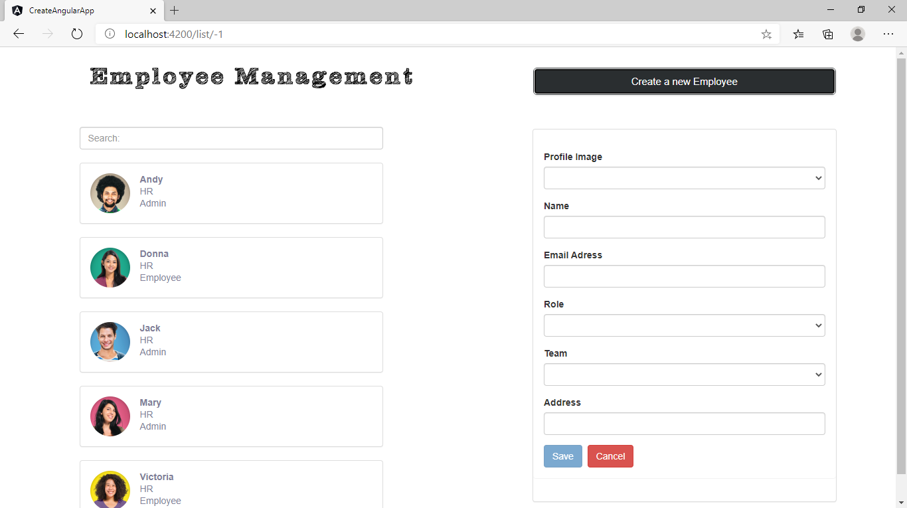
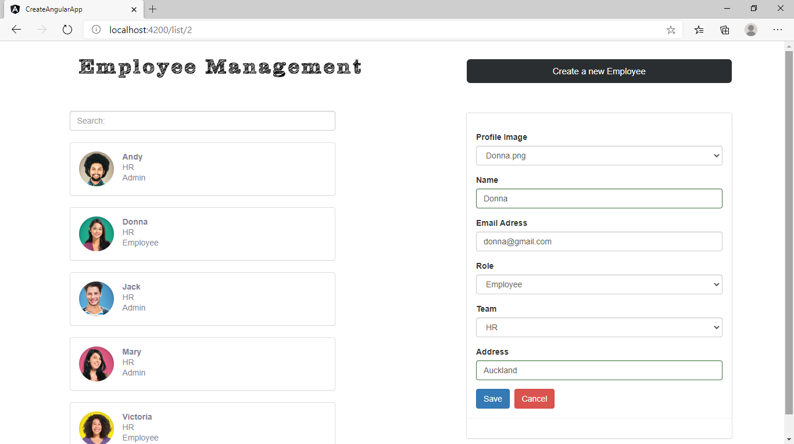
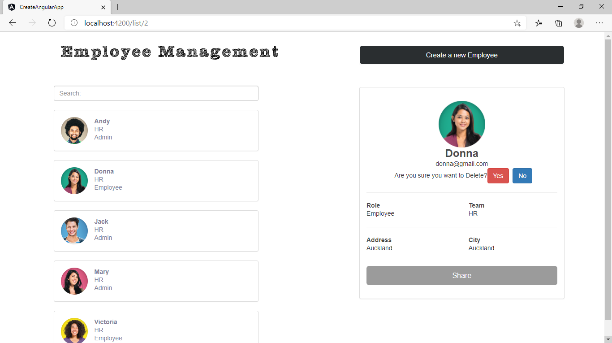

# CreateAngularApp

This project was generated with [Angular CLI](https://github.com/angular/angular-cli) version 10.1.5.

## Development server

Run `ng serve` for a dev server. Navigate to `http://localhost:4200/`. The app will automatically reload if you change any of the source files.

## Code scaffolding

Run `ng generate component component-name` to generate a new component. You can also use `ng generate directive|pipe|service|class|guard|interface|enum|module`.

## Build

Run `ng build` to build the project. The build artifacts will be stored in the `dist/` directory. Use the `--prod` flag for a production build.

## Screenshots
* List
<h1 align="center">
	
</h1>

* Filtered List
<h1 align="center">
	
</h1>

* Create
<h1 align="center">
	
</h1>

* Edit
<h1 align="center">
	
</h1>

* Delete
<h1 align="center">
	
</h1>
